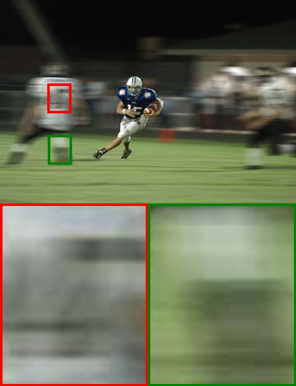

# A Constrained Deformable Convolutional Network for Efficient Single Image Dynamic Scene Blind Deblurring with Spatially-Variant Motion Blur Kernels Estimation (CDCN)

## paper

[Arxiv](https://arxiv.org/pdf/2208.10711.pdf)

## GOPRO Deblur Result

[Google Drive](https://drive.google.com/drive/folders/1oNT-o9sAnLz1MLlKzZTmqvbUPXOr16Gy?usp=sharing)

[百度网盘](https://pan.baidu.com/s/1RUlLM1Ix9QqAuNUzJEs21Q) 提取码: q9q3

## GOPRO Blur Kernel Visualization

[Google Drive](https://drive.google.com/drive/folders/1GXHGNtNAj3YKTqdvIZNJUIZj6sEhBSEH?usp=sharing)

[百度网盘](https://pan.baidu.com/s/1Ve9SI72QxE4gMUTpr2FFeQ) 提取码: qmcm 

## Real Blur Images Deblur Result

[Google Drive](https://drive.google.com/drive/folders/1vTqepKHsaCDQOBg0frh6ubn4P_RsIeSI?usp=sharing)

[百度网盘](https://pan.baidu.com/s/1PwRybRiuWz8i5yuqv1Ttag) 提取码: ulqg

## The qualitative evaluation comparisons of all the methods on the real blurred images.

From left to right are  Blur image, Gao et al.[19], SRN[16], MIMO-UNet+[23], Our CDCN.

